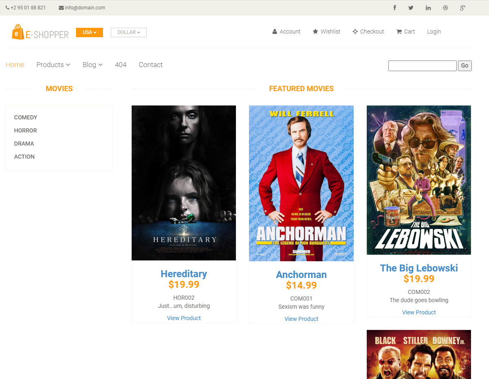
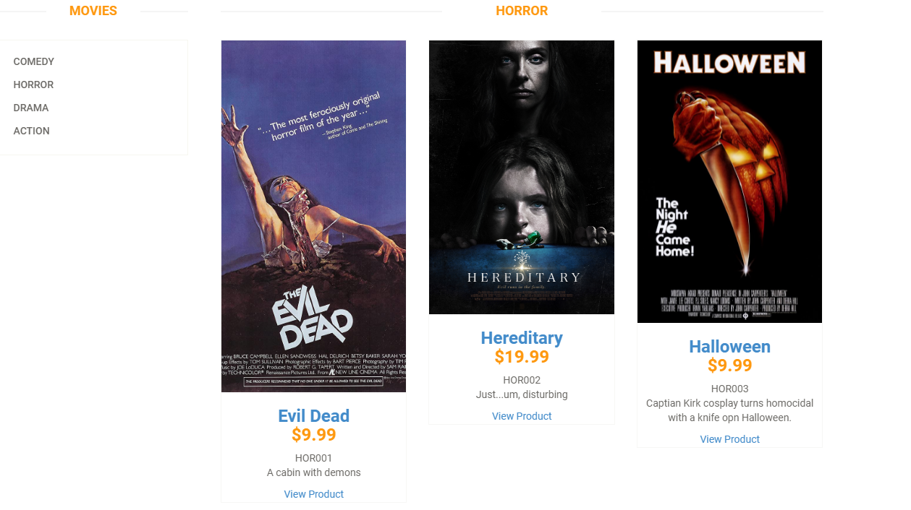
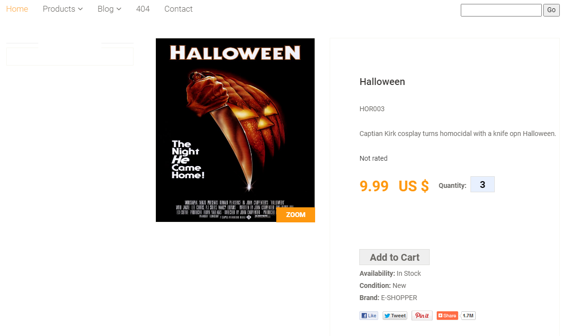

# E-Commerce Store
E-Commerce project for CIS 4250

This was my final project for summer 2021. We created an online store from a template using ASP.NET. Our focus was on making the products page, SQL database, and a shopping cart. I used movies and television for the products, separating them in main categories (Movies, Television, and Streaming), then separated them into subcategories for each main category. 

 <em>Notes: Coding in Visual Basic was actually strange for me, but I was able to pick it up enough to finish the project. Considering we only had 5 weeks in the semester, this seemed impossible at first. Apparently, it was not.</em>

||||
| ----- | ----- | ----- |
| _clicking on a main category, featured products from all subcategories are displayed_ | _clicking on a subcategory displays all products under that subcategory_ | _clicking on the product will display single product details as well as "add to cart" option_ | |
